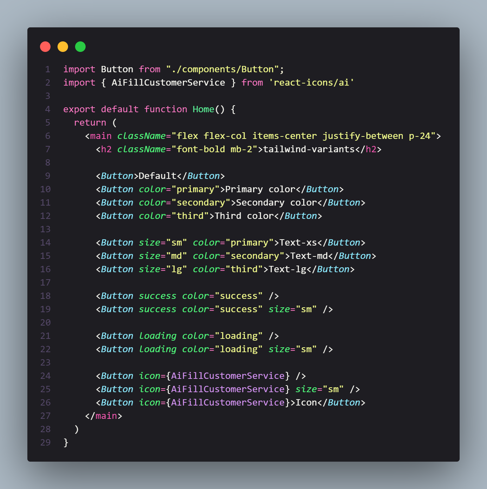
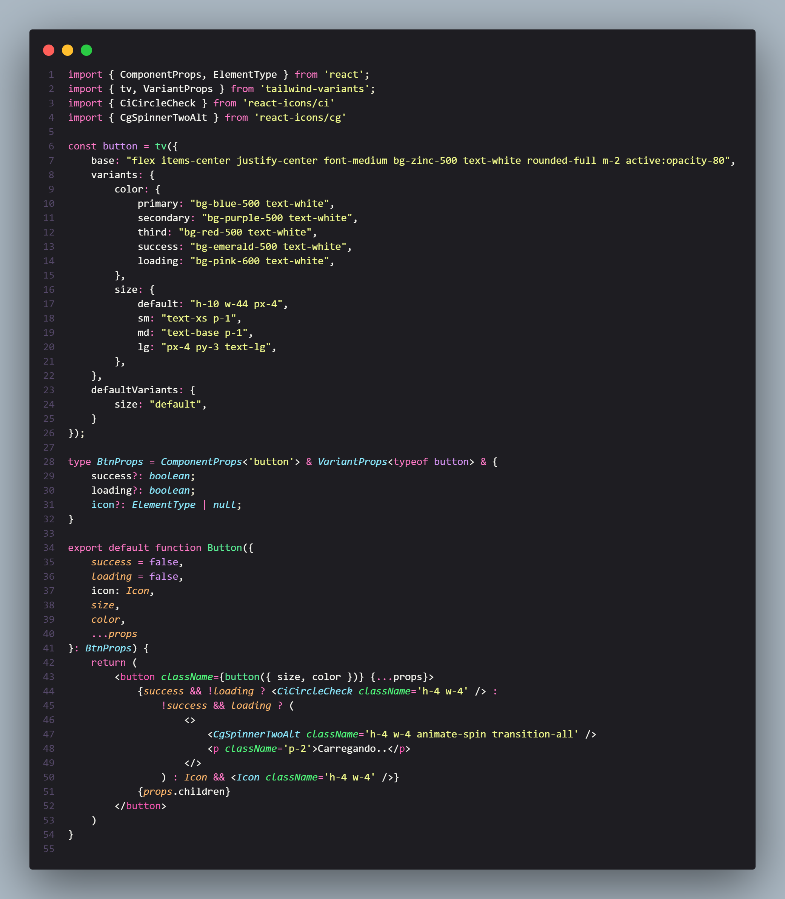

<!-- 

</h1>
   
<h1>Pattern de Composição</h1> 

 -->

## Descrição

### Apenas um projeto simples aplicando os conceitos básicos do tailwind-variants, aplicando em um botão como exemplo. Neste código, eu defino um componente 'Button' que permite criar botões com diferentes estilos e comportamentos. Utilizo a biblioteca 'tailwind-variants' para criar variantes de estilo, como cores e tamanhos. Além disso, o botão pode exibir ícones de sucesso e de carregamento, e até mesmo suporta a adição de ícones personalizados.

[Ver Projeto](https://tailwind-variants-renovatt.vercel.app/)

#

#

#

#

 

## 🛠️ Tecnologias

💻 **Front-end**
- [Next.js 13.4](https://nextjs.org)
- [Typescript](https://www.typescriptlang.org)

📚 **Bibliotecas**
- [react-icons](https://react-icons.github.io/react-icons/)
- [tailwind-variants](https://www.tailwind-variants.org/docs/introduction)

🎨 **Estilização**
- [tailwindcss](https://tailwindcss.com/docs/installation)

🔋 **Versionamento e Deploy**
- [Git](https://git-scm.com)
- [Vercel](https://vercel.com/)

 

⚙️ **Configuranções e Instalações**

Clone do Projeto

    $ git clone https://github.com/renovatt/tailwind-variants.git

Instalando as dependências

    $ npm install

Iniciando o projeto

    $ npm run dev

 

**Como contribuir?**

- Você pode dar suporte me seguindo aqui no GitHub
- Dando uma estrela no projeto
- Criar uma conexão comigo no linkedin fazendo parte da minha networking e curtir o meu projeto.

<!--   -->

**Autor**
[Wildemberg Renovato de Lima](https://www.linkedin.com/in/renovatt/)